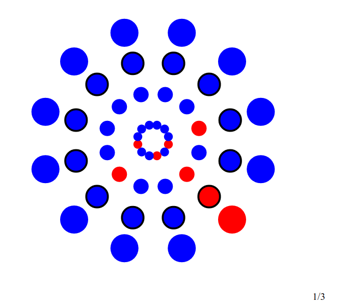

# PaperMarioBattle

This is an implementation of the Paper Mario the Origami King battle system in Elm

[README em português](README.pt-br.md)

[Play!](https://paper-mario-battle-project.netlify.app/)



In the game, you slide tiles around a circle to line up the enemies. With them lined up, you can use your weapons to hit as many of them as possible.
I've implemented just the sliding around part. The blue dots are empty tiles and the red dots are the enemies.

## Controls

```
k - Moves the selector clockwise
j - Moves the selector counterclockwise
spacebar - Changes the selection mode from diametrical to concentric and vice-versa
           (Kind of like rows and columns, but in a circle)
Shift + k - Slides tiles up
Shift + j - Slides tiles down
u - Undoes the last move (Cancels the move in progress instead if there is one)
```
In the bottom right there is a counter showing how many moves have been made and how many moves are allowed in total

There is just one level in there because I really just cared about implementing the mechanics and because it would
likely be some sort of copyright infringement if I put a bunch of them in there.
